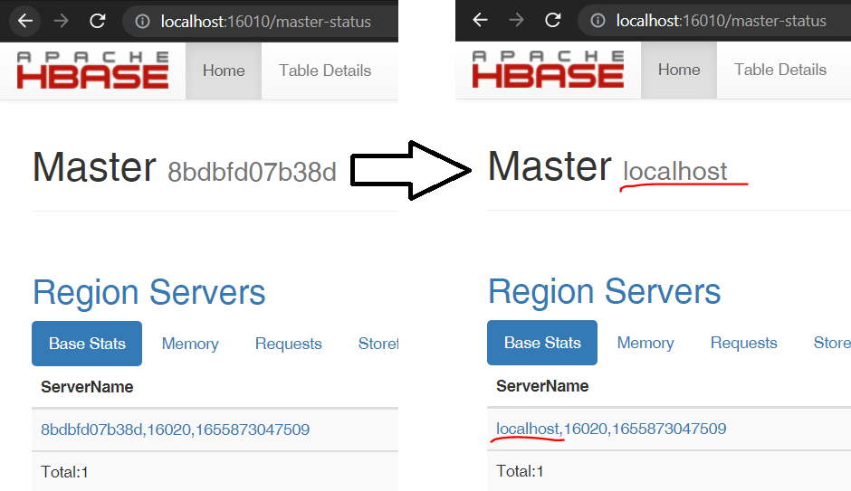

# Sample Scala app using HBase
This app install HBase in a Docker container and then runs a simple Scala app connecting to HBase.

HBase comes with its own Zookeeper.
HBase 2.2.7 comes with Zookeeper 3.4
HBase >=2.3 comes with Zookeeper 3.5
If the configuration `hbase.cluster.distributed` is false it will start its own Zookeeper.
The configuration `HBASE_MANAGES_ZK=false` is ignored if `hbase.cluster.distributed` is false, Zookeeper will start anyways.

## Runing HBase with its own Zookeeper
This example runs a single container with HBase 2.2.7 and Zookeeper 3.4.
The reason for picking this version is that Zookeeper 3.5 inside HBase container doesn't allow any external connection.
So the client Scala app can't connect to Zookeeper. [Check error 2 at the bottom]
The ports required for this container to run are:
```js
16000:16000 # master
16010:16010 # master-ui
16020:16020 # regionserver
16030:16030 # regionserver-ui
2181:2181   # zookeeper
```

#### 1- Build the hbase image:
make build

#### 2- Run the container with hbase and start the server:
make run

#### 3- Check the master node is running and region servers are running:
- http://localhost:16010/master-status
- http://localhost:16030/rs-status

#### 4- Check the master node is connected to zookeeper:
- http://localhost:16010/zk.jsp

#### 5- Run the hbase shell:
make run_shell

then try the following commands:
- status
- list
- create 'table_test', 'cf'
- list 'table_test'
- put 'table_test', 'row1', 'cf:a', 'value1'
- put 'table_test', 'row2', 'cf:b', 'value2'
- put 'table_test', 'row3', 'cf:c', 'value3'
- scan 'table_test'
- get 'table_test', 'row1'

#### 6- Run the app from debugger or use the CLI:
- mvn scala:compile
- mvn scala:run -DmainClass=example.HBaseExample

#### 7- Clean docker image and logs
make clean


## Runing HBase with an external Zookeeper
This example runs a multiple containers using docker compose. It runs HBase 2.4.4 and Zookeeper 3.5.
Via the configurations in `hbase-site.xml` we tell HBase that the Zookeeper is running in `zookeeper:2181`.
Note that  `hbase.cluster.distributed` is false, so Hbase image will still run its own internal zookeeper, but we are not exposing it to the host and we are not using it.

#### 1- Start the services HBase and Zookeeper:
make run_compose

#### 2- Optional do the same checks as above:
Make sure zookeper and Hbase are running.

#### 2- Stop the services HBase and Zookeeper:
make stop_compose


## Common errors:

1. org.apache.hadoop.hbase.client.ConnectionUtils  - Can not resolve 8bdbfd07b38d, please check your network
This happens because HBase is running inside the container, and the container name is 8bdbfd07b38d.
```
7497 [main] WARN  org.apache.hadoop.hbase.client.ConnectionUtils  - Can not resolve 8bdbfd07b38d, please check your network
java.net.UnknownHostException: 8bdbfd07b38d
	at java.net.InetAddress.getAllByName0(InetAddress.java:1281)
	at java.net.InetAddress.getAllByName(InetAddress.java:1193)
	at java.net.InetAddress.getAllByName(InetAddress.java:1127)
```
To fix this, make sure to setup: `hbase.master.ipc.address`, `hbase.regionserver.ipc.address`, `hbase.master.hostname` and `hbase.regionserver.hostname` as in the file `hbase-site.xml`


2. Unable to read additional data from server sessionid 0x0, likely server has closed socket, closing socket connection and attempting reconnect.
This happens when Zookeeper cli can't connect to Zookeeper server.
```
bin/zkCli.sh -server 127.0.0.1:2181
Connecting to 127.0.0.1:2181
...
2022-06-22 14:16:45,296 [myid:] - INFO  [main:ZooKeeper@868] - Initiating client connection, connectString=127.0.0.1:2181 sessionTimeout=30000 watcher=org.apache.zookeeper.ZooKeeperMain$MyWatcher@759ebb3d
2022-06-22 14:16:45,301 [myid:] - INFO  [main:X509Util@79] - Setting -D jdk.tls.rejectClientInitiatedRenegotiation=true to disable client-initiated TLS renegotiation
2022-06-22 14:16:46,385 [myid:] - INFO  [main:ClientCnxnSocket@237] - jute.maxbuffer value is 4194304 Bytes
2022-06-22 14:16:46,394 [myid:] - INFO  [main:ClientCnxn@1681] - zookeeper.request.timeout value is 0. feature enabled=
Welcome to ZooKeeper!
2022-06-22 14:16:46,400 [myid:127.0.0.1:2181] - INFO  [main-SendThread(127.0.0.1:2181):ClientCnxn$SendThread@1125] - Opening socket connection to server localhost/127.0.0.1:2181. Will not attempt to authenticate using SASL (unknown error)
2022-06-22 14:16:46,402 [myid:127.0.0.1:2181] - INFO  [main-SendThread(127.0.0.1:2181):ClientCnxn$SendThread@972] - Socket connection established, initiating session, client: /127.0.0.1:62908, server: localhost/127.0.0.1:2181
2022-06-22 14:16:46,408 [myid:127.0.0.1:2181] - INFO  [main-SendThread(127.0.0.1:2181):ClientCnxn$SendThread@1257] - Unable to read additional data from server sessionid 0x0, likely server has closed socket, closing socket connection and attempting reconnect
JLine support is enabled
[zk: 127.0.0.1:2181(CONNECTING) 0] 2022-06-22 14:16:48,348 [myid:127.0.0.1:2181] - INFO  [main-SendThread(127.0.0.1:2181):ClientCnxn$SendThread@1125] - Opening socket connection to server localhost/127.0.0.1:2181. Will not attempt to authenticate using SASL (unknown error)
2022-06-22 14:16:48,350 [myid:127.0.0.1:2181] - INFO  [main-SendThread(127.0.0.1:2181):ClientCnxn$SendThread@972] - Socket connection established, initiating session, client: /127.0.0.1:62909, server: localhost/127.0.0.1:2181
2022-06-22 14:16:48,351 [myid:127.0.0.1:2181] - INFO  [main-SendThread(127.0.0.1:2181):ClientCnxn$SendThread@1257] - Unable to read additional data from server sessionid 0x0, likely server has closed socket, closing socket connection and attempting reconnect
```

3. 0x5f20155b to 127.0.0.1:2181 failed for list of /hbase, code = CONNECTIONLOSS
Same as the error above, the client can't connect to zookeeper.
```
200194 [ReadOnlyZKClient-127.0.0.1:2181@0x5f20155b] WARN  org.apache.hadoop.hbase.zookeeper.ReadOnlyZKClient  - 0x5f20155b to 127.0.0.1:2181 failed for list of /hbase, code = CONNECTIONLOSS, retries = 29
```
